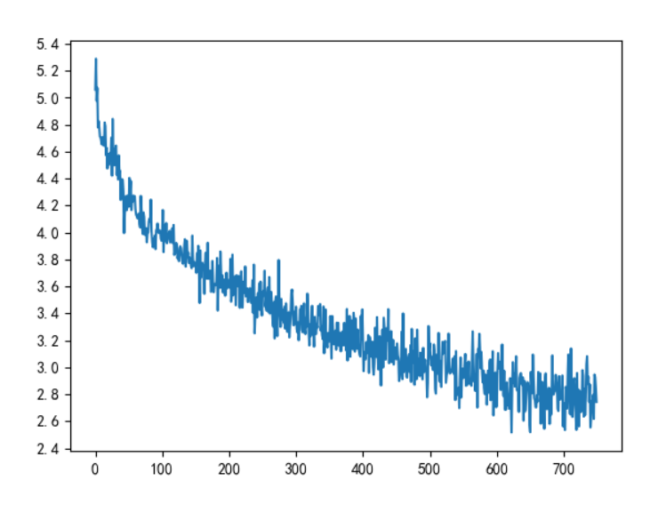

# attention-seq2seq
***
### See for details [https://blog.csdn.net/qq_42714262/article/details/119298940](https://blog.csdn.net/qq_42714262/article/details/119298940)
***
### Requirements
python3.8<br>
pytorch==1.7.1 <br>
matplotlib==3.2.2<br>
jieba==0.42.1
***
### how to use?
**1.train**<br/>
Just execute "train.py"<br>
**2.test**<br>
run the file "test.py"<br>
You can also modify the following code which is in the “test.py” to implement different inputs:<br>
```python
evaluateAndShowAttention("我喜欢你。")
```
***
### Results
1. train loss <br>

2. attention matrix <br>

